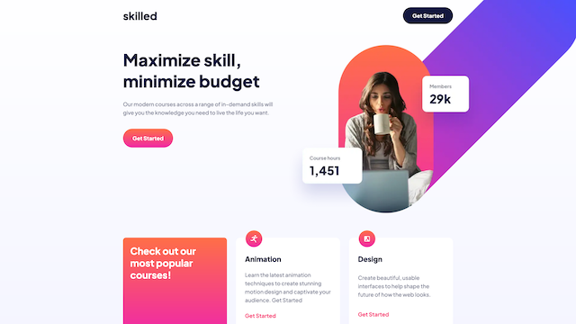

# Frontend Mentor - Skilled e-learning landing page solution

This is a solution to the [Skilled e-learning landing page challenge on Frontend Mentor](https://www.frontendmentor.io/challenges/skilled-elearning-landing-page-S1ObDrZ8q). Frontend Mentor challenges help you improve your coding skills by building realistic projects.

## Table of contents

- [Overview](#overview)
  - [The challenge](#the-challenge)
  - [Screenshot](#screenshot)
  - [Links](#links)
- [My process](#my-process)
  - [Built with](#built-with)
  - [What I learned](#what-i-learned)
  - [Continued development](#continued-development)
  - [Useful resources](#useful-resources)
- [Author](#author)

## Overview

### The challenge

Users should be able to:

- View the optimal layout depending on their device's screen size
- See hover states for interactive elements

### Screenshot

### Links

- [Code](https://github.com/dorian-edwards/e-learning)
- [Live site](https://skilled-learning-platform.netlify.app/)

## My process

### Built with

- Semantic HTML5 markup
- Flexbox
- Mobile-first workflow
- [TypeScript](https://www.typescriptlang.org/)
- [Tailwindcss](https://tailwindcss.com/)
- [React](https://reactjs.org/)

### What I learned

As I alluded to on the [solution page](https://www.frontendmentor.io/solutions/elearning-i-hate-images-edition-mrFYLhhrJd) on frontendmentor.io, the images were a pain in the backside. The image provided is whole, and the effect requires one to offset the image. My first mistake was to just throw the image, and the content to it's left in a flex box and style it that way; this helped me with the layout, but the image shrank and was not offset. Even if I made the image within the flex container `absolute` and offset that, since the container itself changed size and the image was set to that size, it would be offset but shrink, which looked weird.

I then made it a background image on the header section and positioned it on the furthers right side and achieved the offset that way. This was my first sumbited solution but I realized on the largest screens this looked really weird as the image when ALL the way to the right of the screen. In retrospect I realize I could've just given the header element, and thus the background image, a maximum-width.

The third, and final solution was similar to my first, I made an image component placed that within a flex container and offset the absolutely positioned element within. This time, however, I just tinkered with the positioning a little more and, most importantly, I set the flex container containing the image's properties such that it did not shrink, `flex-shrink: 0`. This ensured that the image remained the same width and as the screen collapsed, it covered the image. I also discovered later I had to set overflow-x to hidden to prevent scrolling once the image was covered by the screen.

Overall though, this challenge help me to get a better understanding of how to build a page as individual componenets and then fit those together into a responsive whole. I was used to doing this in pure HTML and CSS, but not in a modular, component based system. I even managed to make some components, e.g. SkillCard, completely resuable unlike my last project.

### Continued development

This project didn't get flagged for any HTML or accessibility issues like my last two, but I think in the future I'll try to incoporate ARIA landmarks to make my page more accessible

### Useful resources

- [TypeScript](https://www.typescriptlang.org/)
- [Tailwindcss](https://tailwindcss.com/)
- [React](https://reactjs.org/)
- [Setting up React with Typescript](https://reactjs.org/docs/static-type-checking.html#typescript)
- [Setting up React with Tailwind](https://tailwindcss.com/docs/guides/create-react-app)

## Author

- Website - [dorianedwards.dev](https://dorianedwards.dev)
- Frontend Mentor - [@dorian-edwards](https://www.frontendmentor.io/profile/dorian-edwards)
- Twitter - [@dorian_dev](https://twitter.com/dorian_dev)
- LinkedIn - [dorian-edwards](https://www.linkedin.com/in/dorian-edwards/)
